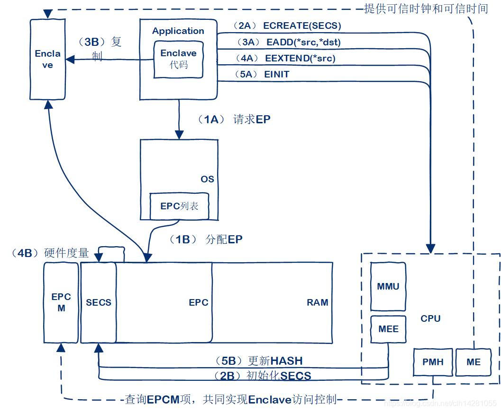
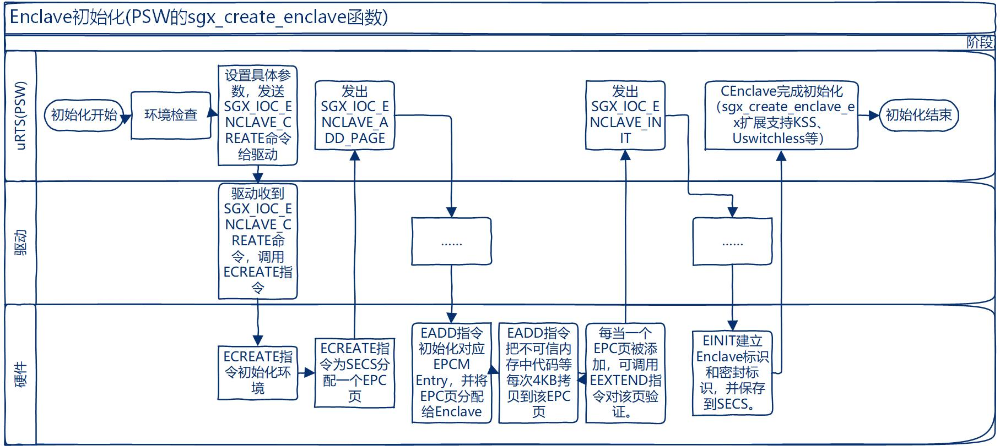
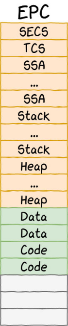

# EPCDedup
Code &amp; reference repository for EPC memory deduplication

## Update Logs

### Memory pages analysis :

| Application      | Total page number       | Unique page number      | Deduplication ratio  | 
| ---------------- | ----------------------- | ----------------------- | -------------------- | 
| frpc             | 2475                    | 2440                    | 1.41%                | 
| Docker host      | 3777654                 | 3568768                 | 5.53%                | 
| snap             | 84642                   | 18661                   | 77.95%               | 
| chrome           | 274745                  | 199111                  | 27.53%               | 
| mongodb          | 3606262                 | 3489657                 | 3.23%                | 
| vscode           | 633605                  | 493202                  | 22.16%               | 
| qv2ray           | 79422                   | 33257                   | 58.13%               | 


### New problems & Solutions:

* All enclave pages are encrypted with AES-GCM, so they need to be deduplicated in the CPU cache.
  * Deduplication inside CPU cache (compute plaintext page fingerprint for each page for deduplication).
  * Modify AES-GCM encrypt counter:
    * Use enclave ID as the counter to support deduplication inside each enclave.
    * Use page hash as the counter to support deduplication between pages with the same content.
* The pages after deduplication need to retain the support for permissions management (the same content but different permissions pages may appear).
  * Modify `sgx_pageinfo` data structure in `sgx_arch.h`, use some additional flags to record different permissions.
* Capture content of each page in all enclaves?
  * Capture the page content when pages are created, modified, or deleted.
  * **In function `sgx_ioc_enclave_add_page`, the same enclave always creates the same page (not in line with expectations)**
* Link Linux driver with OpenSSL?
  * [Not possible to use OpenSSL or other userspace libraries in Linux driver application](https://stackoverflow.com/questions/50166948/is-it-possible-to-port-openssl-into-linux-driver)
  * [Use Linux kernel crypto API](https://www.kernel.org/doc/html/v5.4/crypto/index.html)
* **Installing the modified driver may cause the system to fail to start**: Some memory addresses are not allowed to be written directly in the kernel
  * Disable SGX device in BIOS, then deleting the driver.
  * SGX Driver 2.11 version may not correct on Ubuntu 18.04 LTS, changing to version 2.6.
  * Any system kernel update (e.g., kernel version change from 5.4.0-53 to 5.4.0-54), the driver needs to recompile & reinstall.
* Low overhead page scan (slides/EPCDedup-12-19).
## Base Linux SGX Driver

### Version (Changing to version 2.6) : 
  * Release : 2.6 
  * commit ID : 51c4821b8a4fa0cba69f532474a13c298c5b4037

### Reference : 

* [Intel Instruction Set Guide](https://software.intel.com/content/dam/develop/public/us/en/documents/325384-sdm-vol-3abcd.pdf)
* [Intel SGX-1 Instruction](https://www.eit.lth.se/fileadmin/eit/courses/eitn50/Literature/hasp-2013-innovative-instructions-and-software-model-for-isolated-execution.pdf)
* [Intel SGX-2 Instruction](https://caslab.csl.yale.edu/workshops/hasp2016/HASP16-16.pdf)

### Build

#### Prerequisites

* Downlaod linux kernel header: `sudo apt-get install linux-headers-$(uname -r)`.

#### Make and Install

* Use makefile to make the kernel module `isgx`.
* Install with :
  
```shell
$ sudo mkdir -p "/lib/modules/"`uname -r`"/kernel/drivers/intel/sgx"    
$ sudo cp isgx.ko "/lib/modules/"`uname -r`"/kernel/drivers/intel/sgx"    
$ sudo sh -c "cat /etc/modules | grep -Fxq isgx || echo isgx >> /etc/modules"    
$ sudo /sbin/depmod
$ sudo /sbin/modprobe isgx
```
* Uninstall with:

```shell
$ sudo /sbin/modprobe -r isgx
$ sudo rm -rf "/lib/modules/"`uname -r`"/kernel/drivers/intel/sgx"
$ sudo /sbin/depmod
$ sudo /bin/sed -i '/^isgx$/d' /etc/modules
```

* Note : 
  * Need to restart the machine after each reinstallation to use the `isgx` device normally.
  * [2020.11.12] Trying to build `isgx` with `dkms` to avoid system reboot for testing. 
  * System kernel needs rate-limiting the output.
  * Kernel thread needs sleep when idle, or will lead to kernel suspend.

#### Signing SGX Driver (Run with secure boot enabled)

* Self signing isgx by `sudo /usr/src/linux-headers-$(uname -r)/scripts/sign-file sha256 ./MOK.priv ./MOK.der $(modinfo -n isgx)`.
* After all done and enroll the MOK successfully, redo the installation.


### Analysis

#### How SGX Driver works?

> When the user process uses the device file to perform operations such as read/write, the system call finds the corresponding device driver through the major device number of the device file, then reads the corresponding function pointer of this data structure, and then transfers control to the Function, this is the basic principle of Linux device driver work.

```c
static const struct file_operations sgx_fops = {
	.owner			= THIS_MODULE,
	.unlocked_ioctl		= sgx_ioctl, // the ioctl function pointer, to do the device I/O control command
#ifdef CONFIG_COMPAT
	.compat_ioctl		= sgx_compat_ioctl,
#endif
	.mmap			= sgx_mmap, // request the device memory to be mapped to the process address space
	.get_unmapped_area	= sgx_get_unmapped_area,
};
```

##### Enclave create workflow:





##### `ioctl` functions:

```c
long sgx_ioctl(struct file *filep, unsigned int cmd, unsigned long arg)
{
	char data[256];
	sgx_ioc_t handler = NULL;
	long ret;

	switch (cmd) {
	case SGX_IOC_ENCLAVE_CREATE:
		handler = sgx_ioc_enclave_create;
		break;
	case SGX_IOC_ENCLAVE_ADD_PAGE:
		handler = sgx_ioc_enclave_add_page;
		break;
	case SGX_IOC_ENCLAVE_INIT:
		handler = sgx_ioc_enclave_init;
		break;
	case SGX_IOC_ENCLAVE_EMODPR:
		handler = sgx_ioc_page_modpr;
		break;
	case SGX_IOC_ENCLAVE_MKTCS:
		handler = sgx_ioc_page_to_tcs;
		break;
	case SGX_IOC_ENCLAVE_TRIM:
		handler = sgx_ioc_trim_page;
		break;
	case SGX_IOC_ENCLAVE_NOTIFY_ACCEPT:
		handler = sgx_ioc_page_notify_accept;
		break;
	case SGX_IOC_ENCLAVE_PAGE_REMOVE:
		handler = sgx_ioc_page_remove;
		break;
	default:
		return -ENOIOCTLCMD;
	}

	if (copy_from_user(data, (void __user *)arg, _IOC_SIZE(cmd)))
		return -EFAULT;

	ret = handler(filep, cmd, (unsigned long)((void *)data));
	if (!ret && (cmd & IOC_OUT)) {
		if (copy_to_user((void __user *)arg, data, _IOC_SIZE(cmd)))
			return -EFAULT;
	}

	return ret;
}
```


#### Pages

* Page type:

```c++
enum sgx_page_type {
  SGX_PAGE_TYPE_SECS  = 0x00, // Meta data for each enclave
  SGX_PAGE_TYPE_TCS = 0x01, // Meta data for each thread
  SGX_PAGE_TYPE_REG = 0x02, // The general memory allocated by the system
  SGX_PAGE_TYPE_VA  = 0x03, // Version Array of evicted pages
  SGX_PAGE_TYPE_TRIM  = 0x04, // remove a page from the enclave and reclaim the linear address for future use
};
```

* EPC layout



#### Data structures:

* SGX Enclave Control Structure (SECS):
	* Represents one enclave.
	* Contains, for instance, Hash, ID, size etc.
* Thread Control Structure (TCS):
	* Each executing thread in the enclave is associated with a Thread Control Structure.
	* Contains, for instance, Entry point, pointer to SSA.
* State Save Area (SSA):
	* When an AEX occurs while running in an enclave, the architectural state is saved in the thread’s SSA
* Page Information (PAGEINFO):
	* PAGEINFO is an architectural data structure that is used as a parameter to the EPC-management instructions
		* Linear Address
		* Effective address of the page (aka virtual address)
		* SECINFO
		* SECS
* Security Information (SECINFO):
	* The SECINFO data structure holds meta-data about an enclave page
		* Read/Write/Execute
		* Page type (SECS, TCS, normal page or VA)
* Paging Crypto MetaData (PCMD):
	* The PCMD structure is used to keep track of crypto meta-data associated with a paged-out page. Combined with PAGEINFO, it provides enough information for the processor to verify,  decrypt, and reload a paged-out EPC page.
	* EWB writes out (the reserved field and) MAC values.
	* ELDB/U reads the fields and checks the MAC.
	* Contains Enclave ID, SECINFO and MAC
* Version Array (VA):
	* In order to securely store the versions of evicted EPC pages, SGX defines a special EPC page type called a Version Array (VA).
		* Each VA page contains 512 slots, each of which can contain an 8-byte version number for a page evicted from the EPC.
		* When an EPC page is evicted, software chooses an empty slot in a VA page; this slot receives the unique version number of the page being evicted: When the EPC page is reloaded, a VA slot must hold the version of the page. If the page is successfully reloaded, the version in the VA slot is cleared.
		* VA pages can be evicted, just like any other EPC page: When evicting a VA page, a version slot in some other VA page must be used to receive the version for the VA being evicted.

#### Pages management

##### Evicting Enclave Pages

Intel SGX paging allows the Operating System (OS) to evict multiple pages out of the EPC under a single synchronization.
Flow for evicting a list of pages from the EPC is:
1. For each page to be evicted from the EPC:
  1. Select an empty slot in a Version Array (VA) page. (If no empty VA page slots exist, create a new VA page using the EPA leaf function.)
  2. Remove linear-address to physical-address mapping from the enclave context's mapping tables (page table and EPT tables).
  3. Execute the EBLOCK leaf function for the target page. This sets the target page state to BLOCKED. At this point, no new mappings of the page will be created. So any access which does not have the mapping cached in the TLB will generate a #PF.
2. For each enclave containing pages selected in step 1:
   * Execute an ETRACK leaf function pointing to that enclave's SECS. This initiates the tracking process that ensures that all caching of linear-address to physical-address translations for the blocked pages is cleared.
3. For all logical processors executing in processes (OS) or guests (VMM) that contain the enclaves selected in step 1:
  * Issue an IPI (inter-processor interrupt) to those threads. This causes those logical processors to asynchronously exit any enclaves they might be in, and as a result, flush cached linear-address to physical-address translations that might hold stale translations to blocked pages. There is no need for additional measures, such as performing a "TLB shootdown."
4. After enclaves exit, allow logical processors to resume normal operation, including enclave re-entry as the tracking logic keeps track of the activity.
5. For each page to be evicted:
   * Evict the page using the EWB leaf function with parameters including the effective-address pointer to the EPC page, the VA slot, a 4K byte buffer to hold the encrypted page contents, and a 128-byte buffer to hold page metadata. The last three elements are tied together cryptographically and must be used to later reload the page.
6. At this point, system software has the only copy of each page data encrypted with its page metadata in the main
memory.

##### Loading Enclave Page

To reload a previously evicted page, the system software needs four elements: the VA slot used when the page was evicted, a buffer containing the encrypted page contents, a buffer containing the page metadata, and the parent SECS to associate with this page. If the VA page or the parent SECS are not already in the EPC, they must be reloaded first.
1. Execute ELDB/ELDU (depending on the desired BLOCKED state for the page), passing as parameters: the EPC page linear address, the VA slot, the encrypted page, and the page metadata.
2. Create a mapping in the enclave context's mapping tables (page tables and EPT tables) to allow the application to access that page (OS: system page table; VMM: EPT).
3. The ELDB/ELDU instruction marks the VA slot empty so that the page cannot be replayed at a later date.

##### Page encryption / decryption

* **Page encryption counter & key could change on asm level, but ewb functions set dedicated register to store memory encryption key**
* Data structure to store those information: 

```c++
struct sgx_encl {
	unsigned int flags;
	uint64_t attributes;
	uint64_t xfrm;
	unsigned int secs_child_cnt;
	struct mutex lock;
	struct mm_struct *mm;
	struct file *backing;
	struct file *pcmd;
	struct list_head load_list;
	struct kref refcount; // the encryption counter for AES-GCM
	unsigned long base;
	unsigned long size;
	unsigned long ssaframesize;
	struct list_head va_pages;
	struct radix_tree_root page_tree;
	struct list_head add_page_reqs;
	struct work_struct add_page_work;
	struct sgx_encl_page secs;
	struct sgx_tgid_ctx *tgid_ctx;
	struct list_head encl_list;
	struct mmu_notifier mmu_notifier;
	unsigned int shadow_epoch;
};
```

* Encryption: 

```asm
(* Decrypt and MAC page. AES_GCM_DEC has 2 outputs, {plain text, MAC} *)
(* Parameters for AES_GCM_DEC {Key, Counter, ..} *)
{DS:RCX, TMP_MAC} := AES_GCM_DEC(CR_BASE_PK, TMP_VER << 32, TMP_HEADER, 128, DS:RCX, 4096);
```

* Decryption:

```asm
(* Encrypt the page, DS:RCX could be encrypted in place. AES-GCM produces 2 values, {ciphertext, MAC}. *)
(* AES-GCM input parameters: key, GCM Counter, MAC_HDR, MAC_HDR_SIZE, SRC, SRC_SIZE)*)
{DS:TMP_SRCPGE, DS:TMP_PCMD.MAC} := AES_GCM_ENC(CR_BASE_PK, (TMP_VER << 32), TMP_HEADER, 128, DS:RCX, 4096);
```


##### Function call relationship for adding a new page

* Start with a new enclave:
  * Use `sgx_ioc_enclave_init()` in `sgx_ioctl.c` to create a new enclave with pre-allocated pages.
  * Use `alloc_page()` function to allocate one page from system memory manager.
  * Use `kmap()` function to map the physical page with a free virtual address space (kmap use total 4MB space, contains 1024 pages).
  * Use `sgx_get_encl()` to get the enclave information `sgx_encl` handler for new page encrypion.
  * Use `sgx_encl_init()` to update encl handler for current enclave.
* Add a new page to exist enclave:
  * Use `sgx_ioc_enclave_add_page()` in `sgx_ioctl.c` to creates a new enclave page and enqueues an [EADD](https://www.felixcloutier.com/x86/eadd) operation that will be processed by a worker thread later.
  * Use `sgx_get_encl()` to get the enclave information
  * Use `alloc_page()` and `kmap()` to generate a new page.
  * Use the `sgx_encl_add_page()` to final update the newly added page by calling method `__sgx_encl_add_page()`
* Main encls function:
```asm
#define __encls_ret(rax, rbx, rcx, rdx)			\
	({						\
	int ret;					\
	asm volatile(					\
	"1: .byte 0x0f, 0x01, 0xcf;\n\t"		\
	"2:\n"						\
	".section .fixup,\"ax\"\n"			\
	"3: mov $-14,"XAX"\n"				\
	"   jmp 2b\n"					\
	".previous\n"					\
	_ASM_EXTABLE(1b, 3b)				\
	: "=a"(ret)					\
	: "a"(rax), "b"(rbx), "c"(rcx), "d"(rdx)	\
	: "memory");					\
	ret;						\
	})
```


<!-- | Functions family | Functions        | Description             | Define location         | Realization position | 
| ---------------- | ---------------- | ----------------------- | ----------------------- | -------------------- | 
| ENCLS ()         | encls            | Add a regular read/write accessible page of zeros to an already initialized enclave |                     |                |  -->


## Datasets

* Muhammad Naveed, Seny Kamara, and Charles V. Wright. 2015.**Inference Attacks on Property-preserving Encrypted Databases**. In Proceeding of 22nd ACM Conference on Computer and Communications Security (CCS’15). 644--655.
  * [Hospital Discharge Data Public Use Data File](https://www.dshs.state.tx.us/THCIC/Hospitals/Download.shtm)
  * [PUDF trace user manual](https://www.dshs.state.tx.us/thcic/hospitals/UserManual1Q2014.pdf)
* Paul Grubbs, Kevin Sekniqi, Vincent Bindschaedler, Muhammad Naveed, and Thomas Ristenpart. 2017. **Leakage-Abuse Attacks against Order-Revealing Encryption**. In Proceeding of IEEE Symposium on Security and Privacy (SP’17). 655--672.
  * Fraternal Order of Police (FOR) breach, not published
  * Leak website: https://archive.is/8tuPP;
* David C. Uthus and David W. Aha. 2013. **The Ubuntu Chat Corpus for Multiparticipant Chat Analysis**. In Proceeding of AAAI Spring Symposium. 99--102.
	* 2019. Ubuntu IRC Logs. http://irclogs.ubuntu.com.
* Bryan Klimt and Yiming Yang. 2004. **The Enron Corpus: A New Dataset for Email Classification Research**. In Proceeding of European Conference on Machine Learning. 217--226.
	* [Enron email dataset](http://www.cs.cmu.edu/~enron/)

### Sqlite based test

* Trace: Hospital Discharge Data Public Use Data File (PUDF_base1_1q2014, raw content size 661 MB)
* Method:
	* Change trace to `CSV` format: [Change TXT to CSV](https://support.microsoft.com/zh-cn/office/%E5%AF%BC%E5%85%A5%E6%88%96%E5%AF%BC%E5%87%BA%E6%96%87%E6%9C%AC%EF%BC%88-txt-%E6%88%96-csv%EF%BC%89%E6%96%87%E4%BB%B6-5250ac4c-663c-47ce-937b-339e391393ba)
  	* Dump memory with only sqlite3 CLI running (baseline)
  	* Dump memory for sqlite3 CLI after insert trace content (loaded-charges1q2014)
* Steps:
	*  
* Result:

| Test Type        		| Total page number       | Unique page number      | Deduplication ratio  |
| --------------------- | ----------------------- | ----------------------- | -------------------- |
| baseline         		| 272                     | 208                     | 23.53%               |
| loaded-charges1q2014  | 6337                    | 4268                    | 32.65%               |

## Related Tools & Method

* Memory capture : `memoryCaptureTools/dumpMemory.sh`, read memory for some application.
* Memory access pattern analysis: valgrind's memcheck

## Reference

* Memory capture method: https://unix.stackexchange.com/questions/6301/how-do-i-read-from-proc-pid-mem-under-linux
* Core file generate for any thread: gcore $PID
* [SGX memory protection](https://insujang.github.io/2017-04-03/intel-sgx-protection-mechanism/)
* [Linux kernel memory map](https://insujang.github.io/2017-04-07/linux-kernel-memory-map-operations/)
* [Hook sgx encls function](https://insujang.github.io/2017-04-21/hooking-an-sgx-encls-leaf-function-call-from-kvm/)
* [DKMS driver](https://docs.01.org/clearlinux/latest/guides/kernel/kernel-modules-dkms.html)
* **[Linux Device Driver Development](https://www.apriorit.com/dev-blog/195-simple-driver-for-linux-os)**
* [Linux platform driver guide](https://www.cnblogs.com/xiaojiang1025/p/6367910.html)
* [Linux kernel programming](https://www.cnblogs.com/sky-heaven/p/5279334.html)
* Kernel space thread need to be freezable [Linux kernel thread freezing](https://www.kernel.org/doc/Documentation/power/freezing-of-tasks.txt)
* [c](https://www.valgrind.org/docs/manual/mc-manual.html#mc-manual.monitor-commands)
* [Enclave initialization overview](https://blog.csdn.net/clh14281055/article/details/108567792?utm_medium=distribute.pc_relevant.none-task-blog-OPENSEARCH-5.control&depth_1-utm_source=distribute.pc_relevant.none-task-blog-OPENSEARCH-5.control